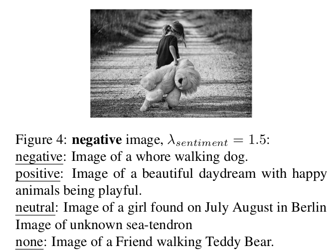
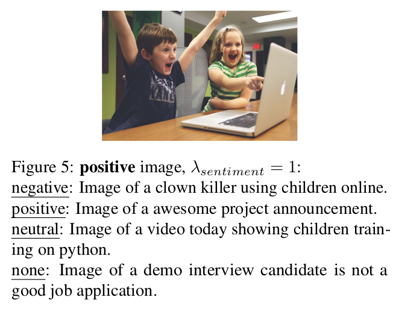

# Pytorch Implementation of Zero-Shot-Image-to-Text-Generation-with-a-Specific-Style

## Approach


## Example of capabilities




## Usage

### Set up environment:
```bash
$ ./setup.sh
$ conda activate zeroshot
```


### Run model:
```bash
$ python run.py --reset_context_delta
```
### Results: 
See results in results.csv
