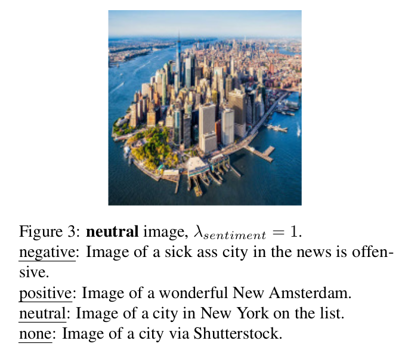

# Pytorch Implementation of Zero-Shot-Image-to-Text-Generation-with-a-Specific-Style

## Approach


## Example of capabilities
variety successful captions of variety images according to the desired sentiment.



The Effect of λ_sentiment on the Caption. as λ is bigger the description in the desired
sentiment perspective is stronger but the maintaining on right language attribute is compromised


## Usage

### Set up environment:
```bash
$ ./setup.sh
$ conda activate zeroshot
```


### Run model:
```bash
$ python run.py --reset_context_delta
```
### Results: 
See results in results.csv
