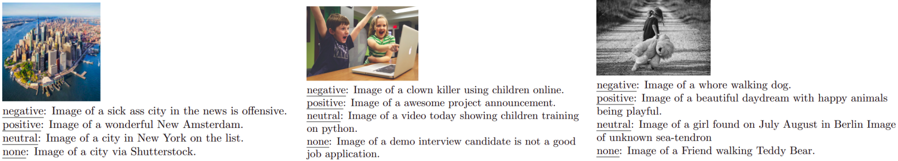

# Pytorch Implementation of Zero-Shot-Image-to-Text-Generation-with-a-Specific-Style

## Approach


## Examples

#### Successful captions of several images expressing the desired sentiment:
  
  
#### The Effect of the Sentiment Loss Coefficient on the Captioning:  
  
The results show that for a small coefficient we fall back to the base-line system, i.e. grammatically correct captioning but without a significant sentiment. On the other hand, too large coefficient produced extreme sen-timent (e.g "amazing..."), but also contaminated GPT-2 context causing grammar mistakes.

## Usage

### Set up environment:
```bash
$ conda env update -f environment.yml
$ conda activate zeroshot
```
Install the appropriate PyTorch version according to your device. See [PyTorch installation instructions](https://pytorch.org/get-started/locally/).
You will probably need to install `torchtext` together with the whole package to ensure compatibility.
For example, installing with `pip3` for Linux and CUDA 11 looks like 
>     pip3 install torch==1.11.0+cu113 torchvision==0.12.0+cu113 torchaudio==0.11.0+cu113 torchtext -f https://download.pytorch.org/whl/cu113/torch_stable.html


### Run model:
```bash
$ python run.py --reset_context_delta
```
### Results: 
See attached results.csv
